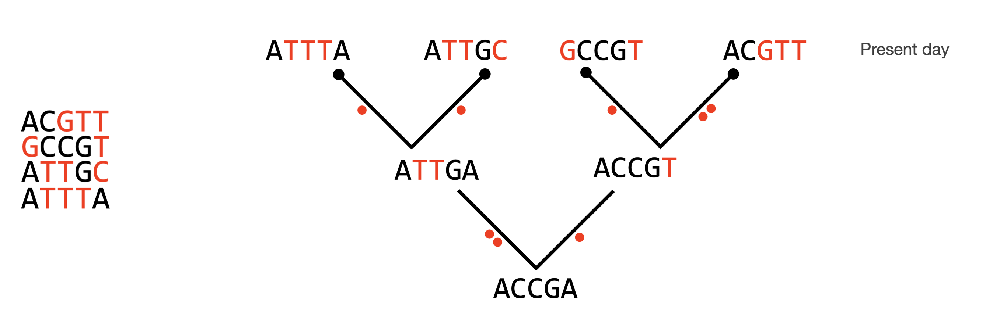
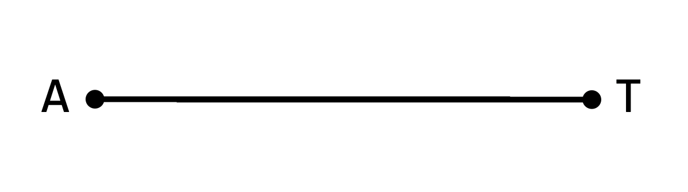

```{r setup, include=FALSE}
knitr::opts_chunk$set(echo = TRUE)
options(digits=4)

# Required libraries
library(tidyverse)
library(expm)

# Functions for later use

# Create Q matrix from rate and pi parameters
createQ = function (ac, ag, at, cg, ct, gt, 
                pia, pic, pig, pit) {
    
    # Compute P matrix 
    qa = - (ac*pic + ag*pig + at*pit)
    qc = - (ac*pia + cg*pig + ct*pit)
    qg = - (ag*pia + cg*pic + gt*pit)
    qt = - (at*pia + ct*pic + gt*pig)
    
    Q = matrix(c(qa,     ac*pic, ag*pig, at*pit, 
                 ac*pia, qc,     cg*pig, ct*pit, 
                 ag*pia, cg*pic, qg,     gt*pit, 
                 at*pia, ct*pic, gt*pig, qt   ), 
               nrow=4, byrow=TRUE, 
               dimnames = list(c("A", "C", "G", "T"), c("A", "C", "G", "T")))
    
    return(Q)
}

# Compute P matrix from Q and t
Q2P = function (Q, t) {
    
    P = expm(Q*t)
    return(P)
}
```

## Probabilistic modeling applied to phylogeny

In molecular phylogeny the observed data is a multiple alignment of sequences (DNA, RNA, or protein). Our model of how this data is generated, is that one, unobserved ancestral sequence evolved into the observed (and typically present-day) sequences, along the branches of a bifurcating phylogenetic tree. The parameters in this model include the tree topology, the branch lengths, and some parameters describing the substitution process.

{ width=80% }

Having a probabilistic model of how sequences evolve allows us to compute the likelihood (the probability of observed data given a model and its parameter values), which means we can use maximum likelihood or Bayesian methods to get estimates of parameter values based on data.

## Substitution as a Markov process

Imagine that we are following a lineage as it evolves through time. If we focus on a single nucleotide site in the genome we will see how it starts out as some nucleotide, and then over a series of time-steps it now and then changes to new nucleotides:

$$
A \rightarrow A \rightarrow G  \rightarrow T  \rightarrow T
$$

This process can be described by a so-called Markov chain (named after the Russian mathematician Andrey Andreyevich Markov, 1856–1922). A Markov chain is a stochastic model describing a system that over a series of time-steps changes between different possible states. At each step there is uncertainty about what the next state will be, and this is captured in a transition probability matrix, which gives the probability of going from any state to any other state in one time-step. Importantly, the transition probability depends only on the current state and not on the history of previous states. This lack of dependency on the previous history of the chain is called the Markov property.

<!-- add sentence here about how this means that the prob of changing does not depend on how long the site has been in any one state -->

In the case of nucleotide substitution, the possible states are the four nucleotides (A, C, G, T), and time-steps could correspond to cell divisions, generations, or perhaps millions of years.

## One-step transition probability matrix

Below is the general structure of a transition matrix for DNA substitution. The original nucleotide state is indicated on the left (rows), and the new state is indicated on the top (columns). The probability that, e.g., an A changes to a G in one time-step is indicated by $p_{AG}$, while for instance $p_{AA}$ is the probability that an A remains unchanged.

$$
  \boldsymbol{P} = \kbordermatrix{
      & \textrm{A} & \textrm{C} & \textrm{G} & \textrm{T}\\
    \textrm{A} & p_{AA} & p_{AC} & p_{AG} & p_{AT}\\
    \textrm{C} & p_{CA} & p_{CC} & p_{CG} & p_{CT}\\
    \textrm{G} & p_{GA} & p_{GC} & p_{GG} & p_{GT}\\
    \textrm{T} & p_{TA} & p_{TC} & p_{TG} & p_{TT}
  }
$$

Note that transition is here used in the sense of the Markov chain transitioning from one state to another, not to be confused with the transition/transversion sense of the word!

Below are examples of transition probability matrices for K2P and GTR-type substitution models:

$$
  \boldsymbol{P}_{K2P} = \kbordermatrix{ 
           & \textrm{A}  & \textrm{C}  & \textrm{G}  & \textrm{T} \\ 
\textrm{A} & 0.76 & 0.06 & 0.12 & 0.06\\
\textrm{C} & 0.06 & 0.76 & 0.06 & 0.12\\
\textrm{G} & 0.12 & 0.06 & 0.76 & 0.06\\
\textrm{T} & 0.06 & 0.12 & 0.06 & 0.76
}
\qquad
\boldsymbol{P}_{GTR} = \kbordermatrix{ 
           & \textrm{A}  & \textrm{C}  & \textrm{G}  & \textrm{T} \\ 
\textrm{A} & 0.677 & 0.046 & 0.103 & 0.174\\
\textrm{C} & 0.023 & 0.553 & 0.169 & 0.255\\
\textrm{G} & 0.034 & 0.113 & 0.569 & 0.284\\
\textrm{T} & 0.043 & 0.127 & 0.213 & 0.617
}
$$

Note how K2P has only two different substitution probabilities (for transitions and transversions respectively), while in the GTR model all substitution probabilities are different.

A few important points about transition probability matrices and DNA substitution models:

* Each row sums to 1: the chain must be in one of the possible states after each time step
* It is typically assumed that different sites in the alignment are evolving independently, allowing us to compute the likelihood for the entire alignment by multiplication of site-likelihoods.
* The transition probabilities in a DNA substitution model correspond to the average tendencies for any nucleotide to change into any other nucleotide. This includes effects from molecular processes such as mutation and DNA-repair but also from subsequent population-level phenomena such as selection and genetic drift. Assuming that these effects are identical across all sites in a genome is of course a huge over-simplification, but nevertheless does capture important aspects of the process. It is possible to make more complicated substitution models that for instance take into account whether substitutions cause amino acid changes.

## Nucleotide distribution and how substitution affects it

The distribution of a Markov chain at some time point, $\boldsymbol{v}_t = \begin{pmatrix} v_{A,t} & v_{C,t} & v_{G,t} & v_{T,t} \end{pmatrix}$, is a vector specifying the probabilities that the chain (here, a single site in an evolving DNA sequence) is in one of the possible states. Since the chain has to be in some state, these entries must sum to 1. In the case of nucleotide substitution models, $\boldsymbol{v}_t$ can also be interpreted as the expected *nucleotide composition* of a DNA sequence evolving according to the model: If any *individual* site has the probability $v_{G,t}$ of being a G for instance, then $v_{G,t}$ is also the expected *fraction* of sites having a G nucleotide, at the time point t.

A site that contains, for instance, the nucleotide G can have been either A, C, G, or T in the previous time-point. The overall probability that the chain ends up in the state G at $t=1$ can therefore be found by considering these 4 possible paths. First, the probability that a site contains an A at $t=0$ and a G at $t=1$ can be computed as:

$$A_0 \rightarrow G_1 \qquad P = v_{A,0}p_{AG}$$

Specifically this is the probability that the site contains an A in the first place ($v_{A,0}$) multiplied by the probability that an A will turn into a G ($p_{AG}$). The probability of the 3 other possible paths are found by similar expressions:

$$C_0 \rightarrow G_1 \qquad P = v_{C,0}p_{CG}$$
$$G_0 \rightarrow G_1 \qquad P = v_{G,0}p_{GG}$$
$$T_0 \rightarrow G_1 \qquad P = v_{T,0}p_{TG}$$

The overall probability that *any* given site ends up containing a G can then be found as the sum of these 4 terms:

$$
v_{G,1} = v_{A,0}p_{AG} + v_{C,0}p_{CG} + v_{G,0}p_{GG} + v_{T,0}p_{TG}
$$

This expression can be seen to be the same as the [dot product](https://en.wikipedia.org/wiki/Dot_product#Algebraic_definition) between $\boldsymbol{v}_0$ and the third column of the transition probability matrix:

$$
\definecolor{LightCyan}{rgb}{0.88,1,1}
\begin{pmatrix} v_{A,0} & v_{C,0} & v_{G,0} & v_{T,0} \end{pmatrix} 
\cdot
\begin{bmatrix}
p_{AA} & p_{AC} & \multicolumn{1}{c}{\cellcolor{LightCyan} p_{AG} } & p_{AT} \cr
p_{CA} & p_{CC} & \multicolumn{1}{c}{\cellcolor{LightCyan} p_{CG} } & p_{CT} \cr
p_{GA} & p_{GC} & \multicolumn{1}{c}{\cellcolor{LightCyan} p_{GG} } & p_{GT} \cr
p_{TA} & p_{TC} & \multicolumn{1}{c}{\cellcolor{LightCyan} p_{TG}} & p_{TT}
\end{bmatrix}
$$

It can be realized that similar expressions hold for the other nucleotides, and that in general we can find the distribution after one time-step (at $t=1$) as the product between the distribution vector for $t=0$ and the transition matrix (multiplying a length-4 vector by a 4x4 matrix as below results in another length-4 vector):

$$
\boldsymbol{v}_1 = \boldsymbol{v}_0 \boldsymbol{P} = 
\begin{pmatrix} v_{A,0} & v_{C,0} & v_{G,0} & v_{T,0} \end{pmatrix} 
\begin{bmatrix}
    p_{AA} & p_{AC} & p_{AG} & p_{AT}\\
    p_{CA} & p_{CC} & p_{CG} & p_{CT}\\
    p_{GA} & p_{GC} & p_{GG} & p_{GT}\\
    p_{TA} & p_{TC} & p_{TG} & p_{TT}
\end{bmatrix}
$$

## Multi-step transition probabilities

The transition probability matrices above give the probabilities of possible changes after *one* time-step. To compute the probability of, for instance, an $A \rightarrow G$ transition in *two* steps, we have to consider the possible paths from the original nucleotide (A) to the final nucleotide (G). There are four possible ways in which A can change to G in two steps (see below), and for each possible path the probability can be found by multiplying the two one-step probabilities:

$$A \rightarrow A \rightarrow G \qquad P = p_{AA} p_{AG}$$
$$A \rightarrow C \rightarrow G \qquad P = p_{AC} p_{CG}$$
$$A \rightarrow G \rightarrow G \qquad P = p_{AG} p_{GG}$$
$$A \rightarrow T \rightarrow G \qquad P = p_{AT} p_{TG}$$

The overall probability of A changing to G in two steps can then be found as the sum of these four terms:

$$
p_\textrm{AG}^{(2)} = p_{AA} p_{AG} + p_{AC} p_{CG} + p_{AG} p_{GG} + p_{AT} p_{TG}
$$

(The notation $p_\textrm{AG}^{(2)}$ means that this is the probability after 2 steps.) Inspection of this expression shows that it is the same as the dot product of the two vectors shown below:

$$
p_\textrm{AG}^{(2)} = \begin{pmatrix} p_{AA} & p_{AC} & p_{AG} & p_{AT} \end{pmatrix} 
                        \begin{pmatrix} p_{AG}\\ p_{CG}\\ p_{GG}\\ p_{TG} \end{pmatrix}
$$

It can further be seen that these vectors in fact correspond to row 1 (changes away from A) and column 3 (changes towards G) in the transition probability matrix:

$$
\definecolor{LightCyan}{rgb}{0.88,1,1}
\kbordermatrix{
& \textrm{A} & \textrm{C} & \textrm{G} & \textrm{T}\\
    \textrm{A} & 
    \multicolumn{1}{>{\columncolor{LightCyan}[1pt][\tabcolsep]}c}{$p_{AA}$} &
    \multicolumn{1}{>{\columncolor{LightCyan}[\tabcolsep][\tabcolsep]}c}{$p_{AC}$} &
    \multicolumn{1}{>{\columncolor{LightCyan}[\tabcolsep][\tabcolsep]}c}{$p_{AG}$} &
    \multicolumn{1}{>{\columncolor{LightCyan}[\tabcolsep][1pt]}c}{$p_{AT}$}\\
    \textrm{C} & p_{CA} & p_{CC} & p_{CG} & p_{CT}\\
    \textrm{G} & p_{GA} & p_{GC} & p_{GG} & p_{GT}\\
    \textrm{T} & p_{TA} & p_{TC} & p_{TG} & p_{TT}
  }
  \qquad \qquad
\kbordermatrix{
           & \textrm{A} & \textrm{C} & \textrm{G} & \textrm{T} \cr
\textrm{A} & p_{AA} & p_{AC} & \multicolumn{1}{c}{\cellcolor{LightCyan} $p_{AG}$ } & p_{AT} \cr
\textrm{C} & p_{CA} & p_{CC} & \multicolumn{1}{c}{\cellcolor{LightCyan} $p_{CG}$ } & p_{CT} \cr
\textrm{G} & p_{GA} & p_{GC} & \multicolumn{1}{c}{\cellcolor{LightCyan} $p_{GG}$ } & p_{GT} \cr
\textrm{T} & p_{TA} & p_{TC} & \multicolumn{1}{c}{\cellcolor{LightCyan} $p_{TG}$} & p_{TT}  }
$$

Due to how [matrix multiplication](https://en.wikipedia.org/wiki/Matrix_multiplication#Illustration) is defined, this means that the two-step transition probability of A changing to G can also be found by multiplying the one-step transition probability matrix, $\boldsymbol{P}$, by itself (thus obtaining $\boldsymbol{P}^2$). $p_\textrm{AG}^{(2)}$ will then be the value in row 1, column 3 of the resulting $4\times4$ matrix.

$$
\definecolor{LightCyan}{rgb}{0.88,1,1}
\boldsymbol{P}\cdot \boldsymbol{P} = \boldsymbol{P}^2 =
\begin{bmatrix}
    \multicolumn{1}{>{\columncolor{LightCyan}[1pt][\tabcolsep]}c}{p_{AA}} &
    \multicolumn{1}{>{\columncolor{LightCyan}[\tabcolsep][\tabcolsep]}c}{p_{AC}} &
    \multicolumn{1}{>{\columncolor{LightCyan}[\tabcolsep][\tabcolsep]}c}{p_{AG}} &
    \multicolumn{1}{>{\columncolor{LightCyan}[\tabcolsep][1pt]}c}{p_{AT}}\\
    p_{CA} & p_{CC} & p_{CG} & p_{CT}\\
    p_{GA} & p_{GC} & p_{GG} & p_{GT}\\
    p_{TA} & p_{TC} & p_{TG} & p_{TT}
\end{bmatrix}
\cdot
\begin{bmatrix}
p_{AA} & p_{AC} & \multicolumn{1}{c}{\cellcolor{LightCyan} p_{AG} } & p_{AT} \cr
p_{CA} & p_{CC} & \multicolumn{1}{c}{\cellcolor{LightCyan} p_{CG} } & p_{CT} \cr
p_{GA} & p_{GC} & \multicolumn{1}{c}{\cellcolor{LightCyan} p_{GG} } & p_{GT} \cr
p_{TA} & p_{TC} & \multicolumn{1}{c}{\cellcolor{LightCyan} p_{TG}} & p_{TT}
\end{bmatrix}
=
\begin{bmatrix}
. & . & p^{(2)}_{AG} & .\\
. & . & . & . \\
. & . & . & . \\
. & . & . & .
\end{bmatrix}
$$

(dots indicate the remaining values which are not shown here). It can be realized that in fact all two-step transition probabilities are to be found in this matrix: in general the probability that nucleotide $i$ changes to nucleotide $j$ over two time-steps is given by the expression:

$$
p_{ij}^{(2)} = \sum_{k} p_{ik}p_{kj}, \textrm{where} \; i, j, k \in \{A,C,G,T\}
$$

This is equivalent to the $p_{AG}^{(2)}$ example above, and can be seen to be the same as the dot product between row $i$ and column $j$ of $\boldsymbol{P}$, and consequently $p_{ij}^{(2)}$ is the same as the entry in row $i$, column $j$ of the matrix product $\boldsymbol{P}^2$. We therefore have that the two-step transition probability matrix is the same as the square of the one-step transition matrix:

$$\boldsymbol{P}^{(2)}=\boldsymbol{P}^2$$

Using the same rationale as above, it can further be realized that the three-step substitution probability matrix can be found as the product of the two-step matrix and $\boldsymbol{P}$:

$$
p_{ij}^{(3)} = \sum_{k} p_{ik}^{(2)}p_{kj} \Rightarrow \boldsymbol{P}^{(3)} = \boldsymbol{P}^{(2)}\boldsymbol{P} = \boldsymbol{P}^2\boldsymbol{P} = \boldsymbol{P}^3
$$

or, more generally, that the n-step transition matrix is the same as the n'th power of the one-step matrix:

$$
\boldsymbol{P}^{(n)}= \boldsymbol{P}^n
$$

## Steady state distribution / equilibrium nucleotide frequencies

The type of transition matrices we use here are associated with a special class of Markov chains called "regular chains". The main characteristic of a regular chain is that every state can be reached from every state (including itself) in a finite number of steps. (In fact, for the Markov chains examined here, all entries of the one-step transition matrix are positive, meaning every state can be reached from every state in just one step - any nucleotide can turn into any other nucleotide, or remain the same, at each time-step). 

It turns out that transition matrices of regular Markov chains have an interesting property, that we can easily demonstrate in RStudio. First let us define a transition matrix, corresponding to the GTR type matrix shown above, in RStudio: \

```{r , comment=NA}
P = matrix(c(0.677, 0.046, 0.103, 0.174, 
             0.023, 0.553, 0.169, 0.255, 
             0.034, 0.113, 0.569, 0.284, 
             0.043, 0.127, 0.213, 0.617), 
           nrow=4, byrow=TRUE, 
           dimnames = list(c("A", "C", "G", "T"), 
                           c("A", "C", "G", "T")))
```

We can raise this transition matrix to the 2nd and 3rd power (using the matrix exponentiation operator %^% from the expm package) to compute the 2- and 3-step transition matrices: \

```{r, message = FALSE, comment=NA}
P %^% 2
```

```{r, message = FALSE, comment=NA}
P %^% 3
```

```{r, include=FALSE, message = FALSE, comment=NA}
# Hidden computations of matrix powers for later inline display
P2 = P %^% 2
P3 = P %^% 3
P50 = P %^% 50
pi = P50[1,]
```

It can be seen how the probability of changing away from the original state increases as the chain takes more steps (for instance see how $p_{AG}$ goes up from `r P[1,3]` in the one-step matrix, to `r P2[1,3]` and then `r P3[1,3]` after 2 and 3 steps respectively). 

But now see what happens if we raise the transition matrix to consecutively higher powers: \

```{r, message = FALSE, comment=NA}
P %^% 10
```
\pagebreak
```{r, message = FALSE, comment=NA}
P %^% 30
```
\
```{r, message = FALSE, comment=NA}
P %^% 50
```
\
```{r, message = FALSE, comment=NA}
P %^% 100
```

Notice that, from $n=30$ and up, the n-step transition matrix, $\boldsymbol{P}^n$, remains constant (at least to 4 significant digits). Moreover, for high $n$, every row of $\boldsymbol{P}^n$ is identical. It turns out that this is true for any transition matrix associated with a regular Markov chain: As we increase the value of $n$, the n-step transition matrix $\boldsymbol{P}^n$ will converge towards a constant value where all the rows are identical. 

What does this mean? If we, for instance, look at the fourth column ("T") in the last matrix above, we can see that all entries are `r P50[1,4]`. The implication of this is that no matter which state the chain starts in, it will have approximately 40% chance of ending up as a T after a sufficiently large number of transitions. Similarly for the other columns. The consequence is that if a sequence evolves for many steps according to this transition matrix, then it will eventually end up with a composition that is equal to the four values in one of the identical rows. We denote the vector of values in each of the identical rows by $\boldsymbol{\pi} = \begin{pmatrix}\pi_A & \pi_C & \pi_G & \pi_T \end{pmatrix}$, and refer to it as the steady-state distribution (or, in molecular phylogeny, as the equilibrium nucleotide frequencies). In the example above, we have the following equilibrium frequencies:

$$
\begin{aligned}
\pi_A &= 0.09918\\
\pi_C &= 0.1999\\
\pi_G &= 0.3001\\
\pi_T &= 0.4007
\end{aligned}
$$

The steady-state distribution can thus be interpreted as the expected composition of a sequence after it has been evolving for a large number of time-steps. In molecular phylogeny we typically assume that sequences are at equilibrium, and that nucleotide frequencies are constant over the entire phylogeny.

This last property (that the composition stays the same after many time-steps) can actually be used to determine the steady-state distribution, and is also a way of checking whether a distribution is at equilibrium. Recall that if the distribution is initially $\boldsymbol{v}_0 = \begin{pmatrix} v_{A,0} & v_{C,0} & v_{G,0} & v_{T,0} \end{pmatrix}$, then the distribution after 1 extra time-step is: $\boldsymbol{v}_1 = \boldsymbol{v}_0 \boldsymbol{P}$. From this we can conclude that when we have reached steady-state, and the composition is therefore $\boldsymbol{\pi} = \begin{pmatrix}\pi_A & \pi_C & \pi_G & \pi_T \end{pmatrix}$, then this will also be the composition after one additional time-step, and the following expression must hold:

$$
\boldsymbol{\pi} = \boldsymbol{\pi} \boldsymbol{P}
$$

This expression together with the constraint that the nucleotide frequencies must sum to one, forms a set of equations that can be solved to find $\boldsymbol{\pi}$.

We can check that this condition is true on the example matrix we used above. Below, I first find $\boldsymbol{\pi}$ as the first row of $P^{100}$ and then multiply this by $P$. \

```{r, message = FALSE, comment=NA}
P100 = P %^% 100
pi = P100[1,]
pi %*% P
```

You can see that the resulting vector is identical to $\boldsymbol{\pi}$ (at 4 significant digits):\

```{r, message = FALSE, comment=NA}
pi 
```

## Time reversibility

The GTR matrix above has one other important property that we can explore using RStudio. See what happens when we compute the value of the following two expressions: $\pi_C \cdot p_{CT}$ and $\pi_T \cdot p_{TC}$: \

```{r, message = FALSE, comment=NA}
( pi["C"] * P["C","T"] ) %>% unname() %>% signif(2)
( pi["T"] * P["T","C"] ) %>% unname() %>% signif(2)
```

We can see that, rounded to two significant digits, these expressions give the same value. It turns out the same is true for the similar expressions for all other pairs of nucleotides. For instance A and T, or C and G: \

```{r, message = FALSE, comment=NA}
( pi["A"] * P["A","T"] ) %>% unname() %>% signif(2)
( pi["T"] * P["T","A"] ) %>% unname() %>% signif(2)
( pi["C"] * P["C","G"] ) %>% unname() %>% signif(2)
( pi["G"] * P["G","C"] ) %>% unname() %>% signif(2)
```

This property, where $\pi_i \cdot p_{ij} = \pi_j \cdot p_{ji}$, is referred to as time reversibility. It is only a property of the GTR matrix above because I explicitly constructed it in such a way that it would be true. If we take an arbitrary transition matrix it will not be the case (note that all rows in the matrix below also sum to 1): \

```{r , comment=NA}
P_bad = matrix(c(0.9,  0.01, 0.07, 0.02, 
                 0.07, 0.85, 0.05, 0.03, 
                 0.1,  0.01, 0.87, 0.02, 
                 0.01, 0.02, 0.03, 0.94), 
              nrow=4, byrow=TRUE,
              dimnames = list(c("A", "C", "G", "T"), 
                              c("A", "C", "G", "T")))

P_bad_100 = P_bad %^% 100
pi_bad = P_bad_100[1,]

( pi_bad["A"] * P_bad["A","C"] ) %>% unname() %>% signif(2)
( pi_bad["C"] * P_bad["C","A"] ) %>% unname() %>% signif(2)
```

As you can see, in this case $\pi_A p_{AC} \neq \pi_C p_{CA}$. The point here is that time reversibility is not an inevitable consequence of modeling nucleotide substitution as a Markov chain. In biological terms time reversibility essentially means that the expected number of, for instance, A sites turning into T, is the the same as the expected number of T sites changing to A, in any given time-step. There is no particular biological reason why this would have to be the case.  Instead time reversibility is an artificial constraint that we put on the models we use in molecular phylogeny. We do that to make computation of likelihood on a tree more convenient. 

To understand why, consider the example below, which illustrates evolution of a genomic site along a single branch from a phylogeny. At one end of the branch, the nucleotide is an A. At the other end it is a T. If we start the computation at the left end, then the probability of this substitution is $\pi_A \cdot p_{AT}$ (the probability of having an A in the first place - $\pi_A$ - multiplied by the probability that A changes to T). If we instead start on the right, then the probability is computed as $\pi_T \cdot p_{TA}$. 

{ width=45% }

Unless the substitution model is  time reversible, these values will be different. As a consequence, the likelihood will depend on where a phylogeny is rooted: if the root is to the left of the A, then the first expression should be used, while the second computation would be correct if the root is to the right of the T. This would be inconvenient, since it would mean we could only ever use likelihood-based methods if we provide an outgroup for rooting (not always simple), or if we repeat the entire likelihood computation for every possible placement of the root (i.e., once for every branch in the unrooted tree). This is the reason nucleotide substitution models are typically constrained to be time reversible: it makes it possible to compute likelihoods on unrooted trees, and the computation can be done from any starting point.

## Nucleotide substitution as a continuous-time Markov process

The substitution models we have explored so far were based on Markov chains that could only change their state in discrete time steps. We could therefore find transition probabilities for any integer number of steps ($1, 2, 3, \ldots$), but not for, e.g., 0.34 or 1.72 time steps. However, for computational purposes it is more convenient to use models where one can compute likelihoods for any possible value of t. This can be achieved by modeling nucleotide substitution by a so-called continuous-time Markov chain (CTMC) instead. A continuous-time Markov chain can change its state at any time t, where t is a real number between 0 and $\infty$. The figure below illustrates a continuous-time Markov chain where a genomic site changes between the four possible nucleotide states over time. The time durations the chain spends in the different states (the lengths of the horizontal red bars) are referred to as sojourn times:

{ width=60% }

In the case of discrete-time Markov chains the process was fully characterized by a one-step transition  matrix. For continuous-time Markov chains, however, there is no smallest possible time-step: the time scale is continuous and transition probabilities are now smooth functions of t - expressed as $\boldsymbol{P}(t)$. A computationally convenient way to describe the Markov process for a CTMC is to instead use a so-called instantaneous rate matrix, $\boldsymbol{Q}$. Below is the general structure of an instantaneous rate matrix and a concrete example of the rate matrix for a GTR-type substitution model:

$$
\kbalignrighttrue
  \boldsymbol{Q} = \kbordermatrix{
      & \textrm{A} & \textrm{C} & \textrm{G} & \textrm{T}\\
    \textrm{A} & q_{AA} & q_{AC} & q_{AG} & q_{AT}\\
    \textrm{C} & q_{CA} & q_{CC} & q_{CG} & q_{CT}\\
    \textrm{G} & q_{GA} & q_{GC} & q_{GG} & q_{GT}\\
    \textrm{T} & q_{TA} & q_{TC} & q_{TG} & q_{TT}
  }
  \qquad
\boldsymbol{Q}_{GTR} = \kbordermatrix{ 
           & \textrm{A}  & \textrm{C}  & \textrm{G}  & \textrm{T} \\ 
\textrm{A} & -2.0 & 0.2 & 0.6 & 1.2\\
\textrm{C} & 0.1 & -3.3 & 1.2 & 2.0\\
\textrm{G} & 0.2 & 0.8 & -3.4 & 2.4\\
\textrm{T} & 0.3 & 1.0 & 1.8 & -3.1
}
$$

The entries in the $\boldsymbol{Q}$ matrix are defined as the first derivative of the transition probabilities $\boldsymbol{P}(t)$ at $t=0$:

$$
q_{ij} = p'_{ij}(0) = \lim_{t \to 0} \frac{p_{ij}(t) - p_{ij}(0)}{t}
$$

To get some intuition about what this expression means, look at the plot below. We are here investigating a single genomic site that initially (at time $t=0$) contains the nucleotide A. We assume that this site is evolving as a continuous-time Markov chain according to the $\boldsymbol{Q}_{GTR}$ matrix shown above. The green(ish) curve shows the probability that the initial A will change to a G ($p_{AG}$), as a function of time. The red curve shows the probability that the A will remain an A  ($p_{AA}$). It can be seen how $p_{AG}$ starts out at 0 and then smoothly increases: the longer we wait, the more likely that the A will change to G. Similarly, $p_{AA}$ starts at 1 (the chain is initially in the A-state), and then decreases. The significance of the instantaneous rates, $q_{AG}$ and $q_{AA}$, is that they are the slopes of these curves at t=0. You may be able to see how the slopes in the plot correspond to the values in $\boldsymbol{Q}_{GTR}$ above ($q_{AG}=0.6$ and $q_{AA} = -2$). 

{ width=70% }

In general, all diagonal elements of the $\boldsymbol{Q}$ matrix, $q_{ii}$, will be negative: If the chain starts out being in state $i$, then, by definition, $\boldsymbol{P}_{ii}(0)=1$ (the chain is "still" in state $i$ after zero time has passed), and $\boldsymbol{P}_{ii}(t)$ must therefore necessarily decrease for increasing $t$, corresponding to an initially negative slope. Moreover, it can be shown that the diagonal entries are equal to minus the sum of the rest of the entries in a row:

$$
q_{ii} = - \sum_{j \neq i}q_{ij}, \; \textrm{where} \; i, j \in \{A,C,G,T\}
$$

This means that each row sums to 0, and is exactly equivalent to how the rows of the transition probability matrix has to sum to 1.

Note that the absolute size of the values in $\boldsymbol{Q}$ depends on the unit of time used, and that they are not restricted to lie between 0 and 1 for instance: time measured in centuries correspond to instantaneous rates that are 100 times larger than if we measure time in years. 

The diagonal entries in $\boldsymbol{Q}$ have another intuitive interpretation, in that they are related to the sojourn times mentioned above (the time the Markov chain spends in one state before changing to the next). Specifically, if the chain is in state $i$ then the sojourn time is a stochastic variable that follows an exponential distribution with the rate parameter $\lambda = -q_{ii}$. On average it will take $\frac{1}{\lambda}$ time units before the chain changes to a new state (so the closer $q_{ii}$ is to 0, the longer the expected time before the chain changes to the next state). For the site we examined above, with $q_{AA}=-2$, the sojourn time distribution is shown in Figure 5 below.

```{r , echo=FALSE, fig.width=3.5, fig.height=2.2, fig.cap="Exponential sojourn time distribution, with rate parameter $\\lambda = -q_{AA}=2$"}
# Plot of GTR probability and meaning of q_ij
q_A = 2

dfexp = tibble(x=c(0,6))
ggplot(dfexp, aes(x=x)) + 
    stat_function(fun=dexp, args=list(q_A), color="blue") + 
    labs(x="Sojourn time", y="Probability density")
```

There is also another way to think of the meaning of the *off-diagonal* entries. Specifically, the relative values of $q_{ij}$, in a given row of the matrix, specify the transition probabilities at the exact instant in time when the chain changes to a new state. Thus the probability that the nucleotide will change from $i$ to $j$ at this time point is $q_{ij}/-q_{ii}$. For the GTR example above this means that $p_{AC}=0.2 / 2 = 0.1$, $p_{AG}=0.6/2=0.3$, and $p_{AT}=1.2/2=0.6$. 

The figure below shows another property of continuous-time Markov chains that is equivalent to how discrete-time Markov chains behave. Note how $p_{AG}$ and $p_{AA}$ converge to constant values. It turns out that these constant values are $\pi_G$ and $\pi_A$ respectively - the equilibrium frequencies of G and A. This behavior of the CTMC corresponds to how the n-step transition matrix for a discrete-time Markov chain converges to the equilibrium frequencies for high n. 

{ width=75% }

## Relationship between $\boldsymbol{Q}$ and $\boldsymbol{P}(t)$

Figure 4 above shows how $\boldsymbol{P}$ is a smooth function of time, and also that it depends on the instantaneous rates in the matrix $\boldsymbol{Q}$. Without going into the details the relationship is as follows:

$$
\boldsymbol{P}'(t) = \boldsymbol{Q}\boldsymbol{P}(t)
$$

This differential equation (with the initial condition that $\boldsymbol{P}(0) = \boldsymbol{I}$) has the solution:

$$
\boldsymbol{P}(t) = e^{\boldsymbol{Q} t}
$$

If you want to know more about why this is so, and what it even means to raise $e$ to the power of $\boldsymbol{Q} \cdot t$, then you can read the accompanying note. The main take-home message here is that continuous-time Markov chains are characterized by an instantaneous rate matrix, $\boldsymbol{Q}$, and that we can find the transition probability matrix $\boldsymbol{P}(t)$, for any time (or branch length) $t$, using the equation above. 

In RStudio, you can compute this matrix-exponential using the expm function from the expm package. Below I have illustrated how to compute the transition probability matrices $\boldsymbol{P}(t=0.1)$ and $\boldsymbol{P}(t=1.3)$ from the GTR-type $\boldsymbol{Q}$-matrix shown above: \

```{r , comment=NA}
Q = matrix(c(-2.0,   0.2,  0.6,  1.2, 
              0.1,  -3.3,  1.2,  2.0, 
              0.2,   0.8, -3.4,  2.4, 
              0.3,   1.0,  1.8, -3.1), 
            nrow=4, byrow=TRUE,
            dimnames = list(c("A", "C", "G", "T"), 
                            c("A", "C", "G", "T")))

expm( Q * 0.1 )
expm( Q * 1.3 )
```

You can see how $p_{AG}$ increases from about 0.06 at t=0.1, to about 0.28 at t=1.3. 

## Steady-state distribution for continuous-time Markov chains

If we compute $\boldsymbol{P}(t)$ for larger values of t, then we can see how the transition probability matrix converges to a constant value, with each row being the steady state distribution (i.e., the equilibrium frequencies of the four nucleotides): \

```{r , comment=NA}
expm( Q * 10 )
```

For this $\boldsymbol{Q}$ matrix, the equilibrium frequencies are therefore $\pi_A = 0.1$, $\pi_C = 0.2$, $\pi_G = 0.3$, and $\pi_T = 0.4$.

It can be shown that if $\boldsymbol{\pi}$ is the steady-state distribution of a continuous-time Markov chain with instantaneous rate matrix $\boldsymbol{Q}$, then it is always the case that:

$$
\boldsymbol{\pi} \cdot \boldsymbol{Q} = \begin{pmatrix} 0 & 0 & 0 & 0 \end{pmatrix}
$$

This is equivalent to how $\boldsymbol{\pi} = \boldsymbol{\pi} \boldsymbol{P}$ for a discrete-time Markov chain, and can be used to check if a given composition is the steady state distribution for a given rate matrix $\boldsymbol{Q}$. As an example, we can check that this is true for the composition $\boldsymbol{\pi} = \begin{pmatrix} 0.1 & 0.2 & 0.3 & 0.4 \end{pmatrix}$ and the rate matrix $\boldsymbol{Q}_{GTR}$ shown above:\

```{r , comment=NA}
( c(0.1, 0.2, 0.3, 0.4) %*% Q ) %>% unname() %>% round(15)
```

## Time-reversibility in continuous-time Markov chains

As mentioned above substitution models are typically constrained to be time-reversible since it makes computation of likelihoods on phylogenies more convenient. A continuous-time Markov chain is time-reversible if the following holds:

$$
\pi_i \cdot q_{ij} = \pi_j \cdot q_{ji} 
$$

If this condition is true, then it will also be true that $\pi_i \cdot p_{ij}(t) = \pi_j \cdot p_{ji}(t)$ for all values of $t$. 

## Construction of a rate matrix for a continuous-time Markov chain with pre-specified steady-state distribution

Imagine that we are interested in constructing a rate matrix, $\boldsymbol{Q}$, for a continuous-time Markov chain in such a way that it is guaranteed to be time-reversible, and such that it has a pre-specified steady-state distribution, $\boldsymbol{\pi}$. One way to achieve this goal is to follow the recipe below:

* First, choose 4 equilibrium nucleotide frequencies $\pi_A, \pi_C, \pi_G$ and $\pi_T$. These have to be positive numbers that sum to 1:

$$
0 < \pi_i < 1, \;\; \sum_{i=1}^4 \pi_i = 1
$$

* Secondly, choose 6 "exchangeability parameters" $r_{AC}$, $r_{AG}$, $r_{AT}$, $r_{CG}$, $r_{CT}$, and $r_{GT}$. These can have any value larger than 0.

* Use the nucleotide frequencies and the exchangeability parameters to compute the off-diagonal entries in the rate matrix $\boldsymbol{Q}$ as shown below:

$$
\boldsymbol{Q} = \kbordermatrix{
      & \textrm{A} & \textrm{C} & \textrm{G} & \textrm{T}\\
    \textrm{A} &        & q_{AC} & q_{AG} & q_{AT}\\
    \textrm{C} & q_{CA} &        & q_{CG} & q_{CT}\\
    \textrm{G} & q_{GA} & q_{GC} &        & q_{GT}\\
    \textrm{T} & q_{TA} & q_{TC} & q_{TG} &
  } =
\kbordermatrix{
      & \textrm{A} & \textrm{C} & \textrm{G} & \textrm{T}\\
    \textrm{A} &                      & \pi_{C} \cdot r_{AC} & \pi_{G} \cdot r_{AG} & \pi_{T} \cdot r_{AT}\\
    \textrm{C} & \pi_{A} \cdot r_{AC} &                      & \pi_{G} \cdot r_{CG} & \pi_{T} \cdot r_{CT}\\
    \textrm{G} & \pi_{A} \cdot r_{AG} & \pi_{C}\cdot r_{CG}  &                      & \pi_{T} \cdot r_{GT}\\
    \textrm{T} & \pi_{A} \cdot r_{AT} & \pi_{C}\cdot r_{CT}  & \pi_{G} \cdot r_{GT} & 
  }
$$
\

* The principle here is that each off-diagonal entry in $\boldsymbol{Q}$ is computed as the product of a nucleotide frequency and an exchangeability parameter. The nucleotide frequency is always the frequency of the target nucleotide (so $\pi_G$ is a term in  $q_{AG}$, $q_{CG}$, and $q_{TG}$). For each of the 6 possible pairs of nucleotides there is one exchangeability parameter that is used for changes in both directions (so $r_{AG}$ is a term in both $q_{AG}$ and $q_{GA}$).

* Finally, compute the diagonal entries in $\boldsymbol{Q}$ such that each row sums to 0:

$$
q_{ii}= - \sum_j q_{ij}, \;\; i \neq j
$$

* Specifically this means the diagonal entries are computed as follows:

    $q_{AA} = - (\pi_{C} \cdot r_{AC} +\pi_{G} \cdot r_{AG} + \pi_{T} \cdot r_{AT})$\
    $q_{CC} = - (\pi_{A} \cdot r_{AC} + \pi_{G} \cdot r_{CG} + \pi_{T} \cdot r_{CT})$\
    $q_{GG} = - (\pi_{A} \cdot r_{AG} + \pi_{C}\cdot r_{CG} + \pi_{T} \cdot r_{GT})$\
    $q_{TT} = - (\pi_{A} \cdot r_{AT} + \pi_{C}\cdot r_{CT} + \pi_{G} \cdot r_{GT})$\

A rate matrix constructed according to these instructions will be time-reversible and will have the steady-state distribution $\boldsymbol{\pi} = \begin{pmatrix} \pi_A & \pi_C & \pi_G & \pi_T \end{pmatrix}$. To see why it is time-reversible, first recall that the condition for time-reversibility is:

$$
\pi_i \cdot q_{ij} = \pi_j \cdot q_{ji}
$$

This is true for the rate matrix constructed above. As an example, let us check the condition for $i=A$ and $j=G$. From the recipe above we have that:

$$
\begin{aligned}
\pi_A \cdot q_{AG}  &= \pi_A \cdot \pi_{G} \cdot r_{AG}\\
\pi_G \cdot q_{GA}  &= \pi_G \cdot \pi_{A} \cdot r_{AG}\\
\end{aligned}
$$
From which it can be seen that the condition $\pi_A \cdot q_{AG} = \pi_G \cdot q_{GA}$ is fulfilled. The same can be shown for all other pairs of nucleotides, which demonstrates that by construction this rate matrix is time-reversible.

To see that this matrix has the equilibrium frequencies $\boldsymbol{\pi}$, first recall that for the steady-state distribution it is true that:

$$
\boldsymbol{\pi} \cdot \boldsymbol{Q} = \begin{pmatrix} 0 & 0 & 0 & 0 \end{pmatrix}
$$
Let us here check the multiplication of $\boldsymbol{\pi}$ and the first column of $\boldsymbol{Q}$ (below I have colored the terms that are multiplied in the dot product):

$$
\definecolor{rcol}{rgb}{1, 0.7, 0.7}
\definecolor{gcol}{rgb}{0.7,1,0.7}
\definecolor{bcol}{rgb}{0.7, 0.7, 1}
\definecolor{ocol}{rgb}{1, 0.8, 0.5}
\begin{aligned}
&\begin{pmatrix} 
  \colorbox{ocol}{$\pi_A$} & 
  \colorbox{rcol}{$\pi_C$} & 
  \colorbox{gcol}{$\pi_G$} & 
  \colorbox{bcol}{$\pi_T$}
\end{pmatrix} 
\begin{pmatrix} 
  \colorbox{ocol}{$- (\pi_{C} \cdot r_{AC} +\pi_{G} \cdot r_{AG} + \pi_{T} \cdot r_{AT})$} & \cdot & \cdot & \cdot \\ 
  \colorbox{rcol}{$\pi_{A} \cdot r_{AC}$}  & \cdot & \cdot & \cdot\\ 
  \colorbox{gcol}{$\pi_{A} \cdot r_{AG}$}  & \cdot & \cdot & \cdot\\ 
  \colorbox{bcol}{$\pi_{A} \cdot r_{AT}$}  & \cdot & \cdot & \cdot
\end{pmatrix}\\
&= 
\begin{pmatrix} 
  \colorbox{ocol}{$-\pi_{A} \cdot (\pi_{C} \cdot r_{AC} +\pi_{G} \cdot r_{AG} + \pi_{T} \cdot r_{AT})$} + 
  \colorbox{rcol}{$\pi_{C} \cdot \pi_{A} \cdot r_{AC}$} +
  \colorbox{gcol}{$\pi_{G} \cdot \pi_{A} \cdot r_{AG}$} +
  \colorbox{bcol}{$\pi_{T} \cdot \pi_{A} \cdot r_{AT}$}  & \cdot & \cdot & \cdot
\end{pmatrix}
\end{aligned}
$$

If we simplify this expression by multiplying $\pi_A$ onto the parenthesis, and then reorganize a bit, we can see that all terms cancel out (I have here used color to indicate terms that cancel out): 

$$
\definecolor{rcol}{rgb}{1, 0.7, 0.7}
\definecolor{gcol}{rgb}{0.7,1,0.7}
\definecolor{bcol}{rgb}{0.7, 0.7, 1}
\begin{aligned}
&= 
\begin{pmatrix} 
  \colorbox{rcol}{$-\pi_{A} \cdot \pi_{C} \cdot r_{AC}$}
  \colorbox{gcol}{$-\pi_{A} \cdot \pi_{G} \cdot r_{AG}$} 
  \colorbox{bcol}{$-\pi_{A} \cdot \pi_{T} \cdot r_{AT}$} 
  \colorbox{rcol}{$+ \pi_{C} \cdot \pi_{A} \cdot r_{AC}$}
  \colorbox{gcol}{$+ \pi_{G} \cdot \pi_{A} \cdot r_{AG}$}
  \colorbox{bcol}{$+ \pi_{T} \cdot \pi_{A} \cdot r_{AT}$} 
  & \cdot & \cdot & \cdot
\end{pmatrix}\\
&= 
\begin{pmatrix} 
  \colorbox{rcol}{$\pi_{C} \cdot \pi_{A} \cdot r_{AC} -\pi_{A} \cdot \pi_{C} \cdot r_{AC}$} +
  \colorbox{gcol}{$\pi_{G} \cdot \pi_{A} \cdot r_{AG} -\pi_{A} \cdot \pi_{G} \cdot r_{AG}$} +
  \colorbox{bcol}{$\pi_{T} \cdot \pi_{A} \cdot r_{AT} -\pi_{A} \cdot \pi_{T} \cdot r_{AT}$}
   & \cdot & \cdot & \cdot
\end{pmatrix}\\
&=
\begin{pmatrix} 
  0  & \cdot & \cdot & \cdot
\end{pmatrix}
\end{aligned}
$$

So, all in all we can see that the dot product between $\boldsymbol{\pi}$ and the first column of $\boldsymbol{Q}$ is 0. It is a bit tedious to check, but it can be realized that the same thing is true for the last 3 columns, and that, no matter which values we plug in for $\boldsymbol{\pi}$ and the exchangeability parameters, it must be the case that $\boldsymbol{\pi} \cdot \boldsymbol{Q} = \begin{pmatrix} 0 & 0 & 0 & 0 \end{pmatrix}$. The criterion is therefore fulfilled and we can see that this rate matrix by design has the steady state distribution $\boldsymbol{\pi}$.

We can also check this empirically in RStudio. Let us first choose 4 nucleotide frequencies and 6 exchangeability parameters:\

```{r , comment=NA}
piA=0.5; piC=0.1; piG=0.15; piT=0.25
rAC=1; rAG=3; rAT=2; rCG=4; rCT=6; rGT=5
```
  
Note that the nucleotide frequencies sum to 1, and that the exchangeability parameters all have different values in the range $1-6$. Based on these values we can then compute the diagonal and off-diagonal values in the $\boldsymbol{Q}$ matrix according to the recipe above:\

```{r , comment=NA}
qAA = - (piC*rAC + piG*rAG + piT*rAT)
qCC = - (piA*rAC + piG*rCG + piT*rCT)
qGG = - (piA*rAG + piC*rCG + piT*rGT)
qTT = - (piA*rAT + piC*rCT + piG*rGT)

Q = matrix(c(  qAA,    piC*rAC, piG*rAG,  piT*rAT, 
             piA*rAC,    qCC,   piG*rCG,  piT*rCT, 
             piA*rAG,  piC*rCG,   qGG,    piT*rGT, 
             piA*rAT,  piC*rCT, piG*rGT,    qTT ), 
           nrow=4, byrow=TRUE, 
           dimnames = list(c("A", "C", "G", "T"), 
                           c("A", "C", "G", "T")))
```

The resulting instantaneous rate matrix looks like this:\

```{r , comment=NA}
Q
```

Note how all diagonal entries are negative, and how each row sums to 0. Recalling that $\boldsymbol{P}(t) = \exp(\boldsymbol{Q}\cdot t)$, we can now compute the transition probability matrix for increasing values of $t$:\

```{r , comment=NA}
expm( Q * 1 )
expm( Q * 3 )
expm( Q * 10 )
```

It can be seen how the pre-specified steady-state distribution $\begin{pmatrix} 0.5 & 0.1 & 0.15 & 0.25 \end{pmatrix}$ does indeed appear as the identical rows of $\boldsymbol{P}(10)$. 

We can also see that, as expected, it is true that $\boldsymbol{\pi} \cdot \boldsymbol{Q} = \begin{pmatrix} 0 & 0 & 0 & 0 \end{pmatrix}$:\

```{r , comment=NA}
pi = c("A"=0.5, "C"=0.1, "G"=0.15, "T"=0.25)
( pi %*% Q ) %>% unname() %>% round(15)
```

Finally, we can check that the matrix is time-reversible by computing $\pi_i \cdot q_{ij}$ and $\pi_j \cdot q_{ji}$ for a few examples of nucleotide pairs:\

```{r , comment=NA}
( pi["A"] * Q["A","G"] ) %>% unname()
( pi["G"] * Q["G","A"] ) %>% unname()
( pi["C"] * Q["C","T"] ) %>% unname()
( pi["T"] * Q["T","C"] ) %>% unname()
```

All in all we can see that the recipe described above does indeed produce instantaneous rate matrices that are time-reversible, and with the steady-state distribution $\boldsymbol{\pi}$.

## Estimation of instantaneous rate matrices in molecular phylogeny

Normally we do of course not have pre-specified values for $\boldsymbol{\pi}$ and the exchangeability parameters $r_{ij}$. Instead we learn these parameter values by fitting a model to some observed sequence data. The point here is that if we parameterize a substitution model as in the recipe above (i.e., if we have parameters corresponding to the 6 different $r_{ij}$ and the 4 $\pi_i$), then our phylogeny software can compute the likelihood for a site on a phylogeny by first computing $\boldsymbol{Q}$ from these free parameters (using the recipe above), and subsequently $\boldsymbol{P}(t)$ (using that $\boldsymbol{P}(t) = \exp(\boldsymbol{Q}\cdot t)$) for any branch length $t$. This allows the software to find, for instance, the parameter values that give the highest likelihood on the observed data.

At this point we can also note that different sub-models in the GTR family can be constructed by constraining sub-sets of these substitution parameters. The table below gives an overview of how some of the more frequently used substitution models are derived from GTR:

Model          Exchangeability parameters                              Base frequency parameters
--------    ---------------------------------------------------     ----------------------------------------
JC            $r_{AC}=r_{AG}=r_{AT}=r_{CG}=r_{CT}=r_{GT}$             $\pi_A=\pi_C=\pi_G=\pi_T=0.25$
K2P           $[r_{AC}=r_{AT}=r_{CG}=r_{GT}]$, $[r_{AG}=r_{CT}]$      $\pi_A=\pi_C=\pi_G=\pi_T=0.25$
HKY           $[r_{AC}=r_{AT}=r_{CG}=r_{GT}]$, $[r_{AG}=r_{CT}]$      All $\pi_i$ free
GTR           All $r_{ij}$ free                                       All $\pi_i$ free
--------    ---------------------------------------------------     ----------------------------------------

## Codon substitution models

In the context of protein-encoding DNA it would make sense to use the codon as the unit of evolution instead of the nucleotide: For instance a $C \rightarrow G$ mutation on a 2nd codon position (where it results in an amino acid change) will typically have a much larger fitness effect than the same mutation on a 3rd codon position (where it will often be silent). This could be captured in a model where different codon/codon substitutions had different rates. 

In principle it is possible to construct a GTR-type substitution model for codons along the lines of how it is done for nucleotides. However, such a model would require a forbidding number of free parameters that would have to be estimated from the data, increasing the risk of problems with overfitting. Specifically, a GTR model for codons parameterised as above would require $61 \cdot 60 / 2 = 1830$ exchangeability parameters (which is the number of entries above the diagonal in a $61 \times 61$ matrix), and 61 codon frequency parameters, for a total of 1891 parameters. Codon models are therefore typically set up in a such a way that they require far fewer parameters. As an example, PAML uses codon models where the instantaneous rates from codon $i$ to codon $j$, $q_{ij}$, are parameterized as follows:

$$
q_{ij} = \begin{cases}
                    0                                   & \textrm{if the two codons differ at more than one position}\\
                    \pi_j                               & \textrm{for synonymous transversion}\\
                    \kappa \cdot \pi_j                  & \textrm{for synonymous transition}\\
                    \omega \cdot \pi_j                  & \textrm{for non-synonymous transversion}\\
                    \omega \cdot \kappa \cdot \pi_j     & \textrm{for non-synonymous transition}
             \end{cases}
$$

(This is for the basic codon model, which can be extended by having for instance 3 different $\omega$ classes). Here, $\pi_j$ is the equilibrium frequency of codon $j$, $\kappa$ is the transition/transversion rate ratio, and $\omega$ is the dN/dS rate ratio. Instead of having one frequency parameter for each of the 61 sense codons, PAML furthermore allows the user to estimate the codon frequencies from the 4 nucleotide frequencies (3 free frequency parameters; the frequency of ATA for instance would be $\pi_{ATA}=\pi_A \cdot \pi_T \cdot \pi_A$), or from the 4 nucleotide frequencies at each of the 3 codon sites (9 free frequency parameters; $\pi_{ATA}=\pi_{A,1} \cdot \pi_{T,2} \cdot \pi_{A,3}$). Using the latter approach therefore means that PAML uses only 11 free parameters to parameterize the entire rate matrix (the 9 frequency parameters + the parameters $\kappa$ and $\omega$). 

Below I have shown the upper left corner (and a bit of the edges) of the $61 \times 61$ matrix $\boldsymbol{Q}$ computed according to this specification (it is relevant that AAA and AAG encode the amino acid Lys, while AAC and AAT encode Asn):

$$
\boldsymbol{Q} =
\kbordermatrix{
                 & \textrm{AAA}            & \textrm{AAC}           & \textrm{AAG}           & \textrm{AAT}             &  \cdots & \textrm{TTT}\\
    \textrm{AAA} &                         & \omega \cdot \pi_{AAC} & \kappa \cdot \pi_{AAG} & \omega \cdot \pi_{AAT}   &  \cdots &  0\\
    \textrm{AAC} & \omega \cdot \pi_{AAA}  &                        & \omega \cdot \pi_{AAG} & \kappa \cdot \pi_{AAT}   &  \cdots &  0\\
    \textrm{AAG} & \kappa \cdot \pi_{AAA}  & \omega \cdot \pi_{AAC} &                        & \omega \cdot \pi_{AAT}   &  \cdots &  0\\
    \vdots       & \vdots                  &  \vdots                & \vdots                 & \vdots                   & \ddots  &  \vdots\\
    \textrm{TTT} & 0                       &     0                  &         0              &        0                 &  \cdots &   \\   
}
$$

It turns out that about 85% of the entries in this matrix are 0, due to the constraint that only one codon position at a time can change.